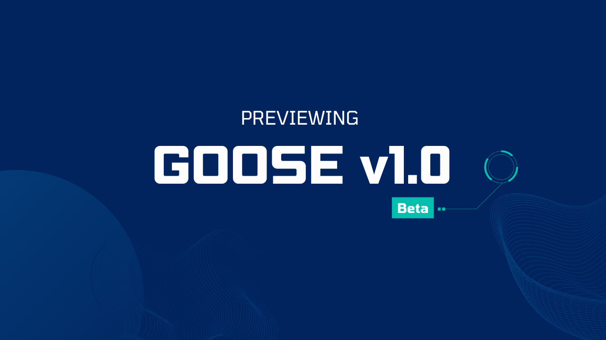

We are excited to share a preview of the new updates coming to pleum with pleum v1.0 Beta!

This major update comes with a bunch of new features and improvements that make pleum more powerful and user-friendly. Here are some of the key highlights.

<!-- truncate -->


## Exciting Features of pleum 1.0 Beta

### 1. Transition to Rust

The core of pleum has been rewritten in Rust. Why does this matter? Rust allows for a more portable and stable experience. This change means that pleum can run smoothly on different systems without the need for Python to be installed, making it easier for anyone to start using it.

### 2. Contextual Memory

pleum will remember previous interactions to better understand ongoing projects. This means you won’t have to keep repeating yourself. Imagine having a conversation with someone who remembers every detail—this is the kind of support pleum aims to offer.

### 3. Improved Plugin System

In pleum v1.0, the pleum toolkit system is being replaced with Extensions. Extensions are modular daemons that pleum can interact with dynamically. As a result, pleum will be able to support more complex plugins and integrations. This will make it easier to extend pleum with new features and functionality.

### 4. Headless mode

You can now run pleum in headless mode - this is useful for running pleum on servers or in environments where a graphical interface is not available.

```sh
cargo run --bin pleum -- run -i instructions.md
```

### 5. pleum now has a GUI

pleum now has an electron-based GUI macOS application that provides and alternative to the CLI to interact with pleum and manage your projects.


### 6. pleum alignment with open protocols

pleum v1.0 Beta now uses a custom protocol, that is designed in parallel with [Anthropic’s Model Context Protocol](https://www.anthropic.com/news/model-context-protocol) (MCP) to communicate with Systems. This makes it possible for developers to create their own systems (e.g Jira, ) that Pleum can integrate with. 

Excited for many more feature updates and improvements? Stay tuned for more updates on pleum! Check out the [pleum repo](https://github.com/gachon-star-want/pleumcode) and join our [Discord community](https://discord.gg/n8R5VaWDAn).


<head>
  <meta property="og:title" content="Previewing Pleum v1.0 Beta" />
  <meta property="og:type" content="article" />
  <meta property="og:url" content="https://docs.pleum.ai/blog/2024/12/06/previewing-pleum-v10-beta" />
  <meta property="og:description" content="AI Agent uses screenshots to assist in styling." />
  <meta property="og:image" content="https://docs.pleum.ai/assets/images/pleum-v1.0-beta-5d469fa73edea37cfccfe8a8ca0b47e2.png" />
  <meta name="twitter:card" content="summary_large_image" />
  <meta property="twitter:domain" content="docs.pleum.ai" />
  <meta name="twitter:title" content="Screenshot-Driven Development" />
  <meta name="twitter:description" content="AI Agent uses screenshots to assist in styling." />
  <meta name="twitter:image" content="https://docs.pleum.ai/assets/images/pleum-v1.0-beta-5d469fa73edea37cfccfe8a8ca0b47e2.png" />
</head>