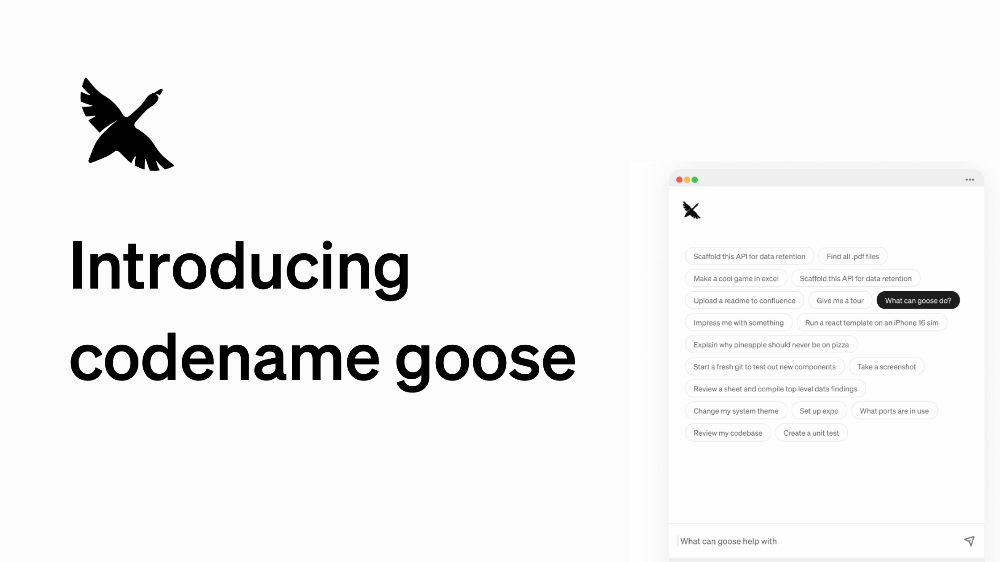

We are thrilled to announce **codename pleum**, your on-machine, open source AI agent built to automate your tasks. 

Powered by your choice of [large language models (LLMs)](/docs/getting-started/providers), a user-friendly desktop interface and CLI, and [extensions](/docs/getting-started/using-extensions) that integrate with your existing tools and applications, pleum is designed to enhance your productivity and workflow.

<!--truncate-->

You can think of pleum as an assistant that is ready to take your instructions, and do the work for you.

While pleum's first use cases are engineering focused, the community has been exploring other non-engineering use cases for pleum as well. And it goes without saying, pleum is [open source](https://github.com/gachon-star-want/pleumcode) 🎉.

## How pleum Works

pleum operates as an intelligent, autonomous agent capable of handling complex tasks through a well-orchestrated coordination of its core features:
  
- **Using Extensions**: [Extensions](/docs/getting-started/using-extensions) are key to pleum’s adaptability, providing you the ability to connect with applications and tools that you already use. Whether it’s connecting to GitHub, accessing Google Drive or integrating with JetBrains IDEs, the possibilities are extensive. Some of these extensions have been curated in the [extensions][extensions-directory] directory. pleum extensions are built on the [Model Context Protocol (MCP)](https://www.anthropic.com/news/model-context-protocol) - enabling you to build or bring your own custom integrations to pleum. 

- **LLM Providers**: pleum is compatible with a wide range of [LLM providers](/docs/getting-started/providers), allowing you to choose and integrate your preferred model. 

- **CLI and Desktop Support**: You can run pleum as a desktop app or through the command-line interface (CLI) using the same configurations across both.

## pleum in Action

pleum is able to handle a wide range of tasks, from simple to complex, across various engineering domains. Here are some examples of tasks that pleum has helped people with:

- Conduct code migrations such as Ember to React, Ruby to Kotlin, Prefect-1 to Prefect-2 etc. 
- Dive into a new project in an unfamiliar coding language
- Transition a code-base from field-based injection to constructor-based injection in a dependency injection framework.
- Conduct performance benchmarks for a build command using a build automation tool
- Increasing code coverage above a specific threshold
- Scaffolding an API for data retention
- Creating Datadog monitors
- Removing or adding feature flags etc.
- Generating unit tests for a feature

## Getting Started

You can get started using pleum right away! Check out our [Quickstart](/docs/quickstart).

## Join the pleum Community

Excited for upcoming features and events? Be sure to connect with us!

- [GitHub](https://github.com/gachon-star-want/pleumcode)
- [Discord](https://discord.gg/n8R5VaWDAn)
- [YouTube](https://www.youtube.com/@pleum-oss)
- [LinkedIn](https://www.linkedin.com/company/pleum-oss)
- [X](https://x.com/pleum_oss)
- [BlueSky](https://bsky.app/profile/opensource.block.xyz)

[extensions-directory]: https://docs.pleum.ai/v1/extensions

<head>
  <meta property="og:title" content="Introducing codename pleum" />
  <meta property="og:type" content="article" />
  <meta property="og:url" content="https://docs.pleum.ai/blog/2024/12/11/resolving-ci-issues-with-pleum-a-practical-walkthrough" />
  <meta property="og:description" content="codename pleum is your open source AI agent, automating engineering tasks and improving productivity." />
  <meta property="og:image" content="https://docs.pleum.ai/assets/images/introducing-codename-pleum-89cac25816e0ea215dd47d4b9768c8ab.png" />
  <meta name="twitter:card" content="summary_large_image" />
  <meta property="twitter:domain" content="docs.pleum.ai" />
  <meta name="twitter:title" content="Introducing codename pleum" />
  <meta name="twitter:description" content="codename pleum is your open source AI agent, automating engineering tasks and improving productivity." />
  <meta name="twitter:image" content="https://docs.pleum.ai/assets/images/introducing-codename-pleum-89cac25816e0ea215dd47d4b9768c8ab.png" />
</head>
