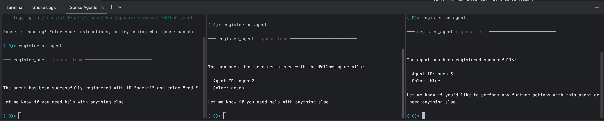

During our [previous livestream](https://youtu.be/9tq-QUnE29U), Aaron Goldsmith, Infrastructure Operations Engineer at Cash App, showed a team of pleum AI agents collaborating in real time to create a website. Our community loved it so much, Cliff Hall was inspired to iterate on that idea and create a pleumTeam MCP server.

<!--truncate-->

## The Original Protocol

Aaron Goldsmith made an AI agent team consisting of multiple pleum instances a reality with his lightweight [Agent Communication Protocol](https://gist.github.com/AaronGoldsmith/114c439ae67e4f4c47cc33e829c82fac). With it, each pleum agent enters the chat, gets assigned a role (e.g. Project Coordinator, Researcher, Web Developer), and works on its part of a given task. The protocol specifies instructions guiding how the agents should talk and behave, allowing multiple pleum agents to collaborate. It also specifies that communication between the agents should be done via a Python-based websocket server with text/markdown . 

## pleumTeam MCP Server

Introducing [pleumTeam](https://github.com/cliffhall/pleumTeam), created by Software Architect and community member, Cliff Hall. pleumTeam takes Aaron's protocol and iterates on it into an MCP server and collaboration protocol for pleum Agents. With features like task management, message storage, and agent waiting, you can have an entire team of pleum agents work together on a task or project for you.

A pleum agent with the Project Coordinator role will assign roles to other agents, your connected agents will send messages that can retrieved at any time, and your team of agents will connect to the same MCP server to collaborate together.

## A New Way to pleum

Working with a team of AI agents on a task is a game changer. Instead of getting confused as to how to improve your prompt engineering on your own or work across sessions manually, tools like Cliff's pleumTeam or Aaron's Agent Communication Protocol help us make sure AI agents like pleum are doing the work for us as efficiently as possible. The possibilities feel endless!

## Get Your Contribution Featured
Hopefully this contribution inspired you as much as it inspired our community. If you have a pleum contribution or project you'd like to share with our community, join our [Discord](https://discord.gg/n8R5VaWDAn) and share your work in the **#share-your-work** channel. You may just be featured on our livestream or get a cool prize. 👀 You can also star pleum on GitHub or follow us on social media so you never miss an update from us. Until next time!

<head>
  <meta property="og:title" content="Let A Team of AI Agents Do It For You" />
  <meta property="og:type" content="article" />
  <meta property="og:url" content="https://docs.pleum.ai/blog/2025/02/17/pleumteam-mcp" />
  <meta property="og:description" content="Community Spotlight on Cliff Hall's pleumTeam MCP server." />
  <meta property="og:image" content="https://docs.pleum.ai/assets/images/pleumteam-mcp-082fa2890c313519c2a1637ca979c219.png" />
  <meta name="twitter:card" content="summary_large_image" />
  <meta property="twitter:domain" content="docs.pleum.ai" />
  <meta name="twitter:title" content="Let A Team of AI Agents Do It For You" />
  <meta name="twitter:description" content="Community Spotlight on Cliff Hall's pleumTeam MCP server." />
  <meta name="twitter:image" content="https://docs.pleum.ai/assets/images/pleumteam-mcp-082fa2890c313519c2a1637ca979c219.png" />
</head>