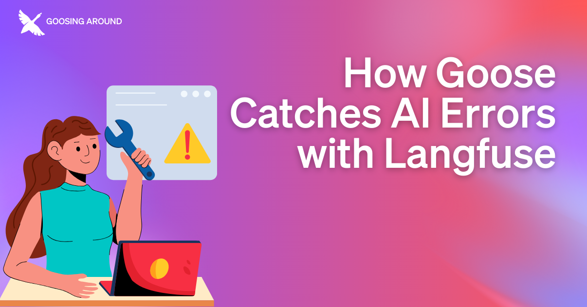

How do we debug AI agents like pleum? In the [Goosing Around](https://youtube.com/playlist?list=PLyMFt_U2IX4uFFhd_2TD9-tlJkgHMMb6F&feature=shared) stream series, host [Rizel Scarlett](https://www.linkedin.com/in/rizel-bobb-semple/) invited [Marc Klingen](https://www.linkedin.com/in/marcklingen/), Co-Founder at Langfuse, and [Alice Hau](https://www.linkedin.com/in/alice-hau/), Machine Learning Engineer at Block, to demo how Langfuse enables observability into pleum's actions, letting you trace LLM behavior and catch errors.

<!--truncate-->

## What is Langfuse

[Langfuse](https://langfuse.com/) is an open source observability platform specifically designed for LLM-powered apps. Mark revealed during stream that Langfuse wasn't originally an observability platform, it was born from early attempts to build an AI agent like pleum. 

While they were limited by the available models at the time, especially with multi-file edits, the team discovered the tooling they had built for debugging and monitoring their agent was more valuable to them than their agent.

## How Langfuse Works With pleum
Since traditional observability tools don't quite cut it when it comes to AI agents. Langfuse introduces 3 core concepts to make pleum's behavior more observable, and create logs that are easier to parse:

### Traces

Each interaction with pleum creates a trace to capture the full story of what happened. These traces include key information, from the initial prompt and user messages to tool calls and their responses. They also store valuable metadata about model outputs and timing information, giving developers a complete picture of each interaction.

### Timeline View
The timeline view takes these complex interactions and transforms it into a digestible format. Developers can see parallel task execution in real-time, understand the dependencies between different actions, and measure the actual duration of each operation. This can be super helpful when debugging a complex sequence of actions taken by pleum, or to help optimize performance.

### Structured Data
Alice explained, "pleum sessions can be really long... we have log files, but you'll just see a massive log of JSON."

Rather than rangle raw JSON log, Langfuse helps organize this data to help make navigating longer sessions and their data more straightforward. This approach can help developers easily analyze tool usage patterns, monitor token consumption, and quickly identify any performance bottlenecks and where they may happen.

With this integration, you can instead better understand the sequence of actions taken by pleum, and analyze track token usage and model behavior across LLMs.

## Practical Benefits
The observability the pleum and Langfuse integration brings is great for anyone who wants clear insight into what pleum is doing behind the scenes. Alice and Marc discussed the different ways this integration can help you debug faster.

Developers can dive deeper into detailed session logs and identify the root cause to a reported issue and ensure pleum is operating as efficiently as possible. Like checking why certain commands may not be working as expected, or seeing exactly how pleum is processing information for a given task with a specific LLM. 

As developers focus on operational efficiency, researchers can use the analytical capabilities of this integration to better understand which models best suit their needs. Through comprehensive model evaluations, they can analyze how different models handle tool calling, understand decision-making patterns across LLMs, and establish a systematic approach to understanding and improving AI systems.

# The Future of AI Observability
These powerful debugging and analysis capabilities are only the beginning. This integration between pleum and Langfuse represents a significant step forward in making AI agents as transparent and debuggable as traditional code.

To keep up with the exciting developments as they release, you can check out both of the [pleum](https://github.com/gachon-star-want/pleumcode) and [Langfuse](https://github.com/langfuse/langfuse) repositories on GitHub. 

You can also watch the [livestream discussing the pleum and Langfuse integration](https://www.youtube.com/live/W39BQjsTS9E?feature=shared), and follow the [tutorial showing you how to integrate Langfuse with pleum](/docs/tutorials/langfuse).

Also, be sure to subscribe to our [events calendar](https://calget.com/c/t7jszrie) to catch upcoming events.

<head>
  <meta property="og:title" content="How pleum Catches AI Errors with Langfuse" />
  <meta property="og:type" content="article" />
  <meta property="og:url" content="https://docs.pleum.ai/blog/2025/03/18/pleum-langfuse" />
  <meta property="og:description" content="Get detailed insights into pleum's behavior with Langfuse's observability tools." />
  <meta property="og:image" content="http://docs.pleum.ai/assets/images/pleum_aierrors-22154af884db86789ce1a12a72897e8e.png" />
  <meta name="twitter:card" content="summary_large_image" />
  <meta property="twitter:domain" content="docs.pleum.ai" />
  <meta name="twitter:title" content="How pleum Catches AI Errors with Langfuse" />
  <meta name="twitter:description" content="Get detailed insights into pleum's behavior with Langfuse's observability tools." />
  <meta name="twitter:image" content="http://docs.pleum.ai/assets/images/pleum_aierrors-22154af884db86789ce1a12a72897e8e.png" />
</head>